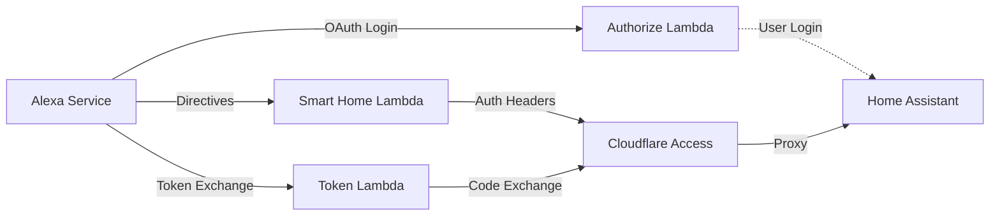
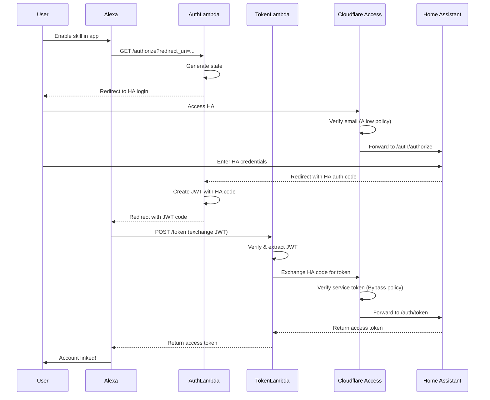
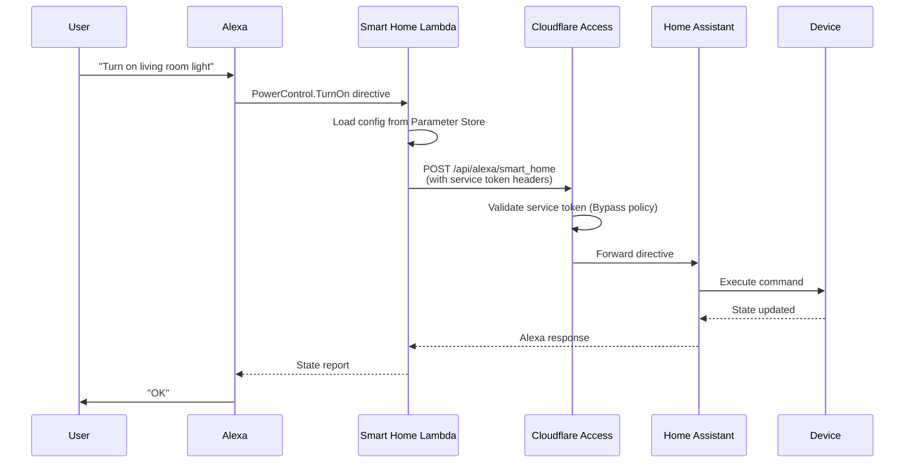

# Home Assistant Alexa Integration

AWS Lambda solution for integrating Amazon Alexa Smart Home Skills with self-hosted Home Assistant. Features stateless OAuth account linking and secure authentication via Cloudflare Access.

**Note**: This requires AWS Lambda, Cloudflare Tunnel, and technical knowledge. Setup takes 30-45 minutes. For a simpler approach, consider [Nabu Casa Cloud](https://www.nabucasa.com/).

## Features

- **Smart Home Control** - Forward Alexa directives to Home Assistant (Discovery, PowerControl, BrightnessControl, etc.)
- **Stateless OAuth** - JWT-based authorization flow
- **Zero-Trust Security** - Cloudflare Access authentication for all Home Assistant requests
- **Token Sanitization** - Automatic redaction of sensitive data in logs
- **AWS Parameter Store** - Free, encrypted secret storage
- **Python 3.13** - Modern syntax with 100% type hints, 133 tests, 95% coverage

## Prerequisites

- Python 3.13+ (for development)
- AWS Account with Lambda access and configured credentials
- Self-hosted Home Assistant with Alexa integration
- Cloudflare Account (free tier) with custom domain
- AWS SAM CLI

## Quick Start

1. Setup Cloudflare Tunnel for Home Assistant
2. Clone and deploy Lambda functions using AWS SAM
3. Create Alexa skill in Developer Console
4. Configure Home Assistant for Alexa
5. Enable skill in Alexa app and discover devices

## Installation

### 1. Clone Repository

```bash
git clone https://github.com/tjbaker/ha-alexa.git
cd ha-alexa
```

### 2. Setup Virtual Environment (Development)

```bash
python3 -m venv .venv
source .venv/bin/activate
pip install -e ".[dev]"
```

### 3. Deploy to AWS Lambda

Install AWS SAM CLI:

```bash
# macOS
brew install aws-sam-cli

# Verify
sam --version
```

Build and deploy:

```bash
# Build Lambda package
sam build

# Deploy (interactive first time)
sam deploy --guided
```

During `sam deploy --guided`, provide:
- **Stack name**: `ha-alexa`
- **AWS Region**: `us-east-1` (or your preferred region)
- **HomeAssistantUrl**: Your HA URL (e.g., `https://ha.example.com`)
- **CloudflareClientId**: Service token client ID (from Cloudflare Access)
- **CloudflareClientSecret**: Service token client secret
- **AlexaSkillId**: `amzn1.ask.skill.xxx` (create skill first, then redeploy)
- **AlexaVendorId**: Get from Alexa Developer Console > Your Skill > Account Linking section (see note below)
- **OAuthJwtSecret**: Random string (`openssl rand -base64 32`)
- **VerifySSL**: `true` (recommended)
- **DebugMode**: `false`
- **Confirm changes**: `Y`
- **Allow SAM CLI IAM role creation**: `Y`
- **Save to configuration file**: `Y`

After successful deployment, SAM will display the CloudFormation stack outputs. Save these values:
- `AlexaSmartHomeFunctionArn` - Use this as the Alexa skill endpoint
- `AlexaAuthorizeFunctionUrlOutput` - Use this as the Authorization URI
- `AlexaOAuthFunctionUrl` - Use this as the Access Token URI

You can view outputs anytime with: `sam list stack-outputs --stack-name ha-alexa`

## Cloudflare Tunnel Setup

<details>
<summary>Click to expand Cloudflare setup instructions</summary>

### Recommended: Home Assistant Add-on (Easiest)

**For Home Assistant OS or Supervised:**

1. **Install Add-on**
   - Settings > Add-ons > Add-on Store
   - Search for "Cloudflare Tunnel"
   - Install the official Cloudflare add-on

2. **Configure Add-on**
   - Get Cloudflare Tunnel token from Cloudflare Zero Trust dashboard
   - Add token to add-on configuration
   - Start the add-on

3. **Setup DNS**
   - In Cloudflare dashboard, point your domain to the tunnel
   - Example: `homeassistant.yourdomain.com` → your tunnel

### Alternative: Manual Installation (Container/Core)

**For Home Assistant Container or Core:**

```bash
# Install cloudflared
curl -L --output cloudflared https://github.com/cloudflare/cloudflared/releases/latest/download/cloudflared-linux-amd64
chmod +x cloudflared
sudo mv cloudflared /usr/local/bin/

# Create tunnel
cloudflared tunnel login
cloudflared tunnel create ha-tunnel
cloudflared tunnel route dns ha-tunnel homeassistant.yourdomain.com

# Configure (create /etc/cloudflared/config.yml)
tunnel: <tunnel-id>
credentials-file: /root/.cloudflared/<tunnel-id>.json
ingress:
  - hostname: homeassistant.yourdomain.com
    service: http://localhost:8123
  - service: http_status:404

# Start service
sudo cloudflared service install
sudo systemctl start cloudflared
```

### Setup Cloudflare Access (Required for Both Methods)

In Cloudflare Zero Trust dashboard:

1. **Create Service Token First**
   - Zero Trust > Access > Service Auth > Service Tokens
   - Click "Create Service Token"
   - Name: `Lambda Functions`
   - Save the **Client ID** and **Client Secret** (you'll need these for SAM deployment)

2. **Create Application**
   - Zero Trust > Access > Applications > Add an application
   - Type: Self-hosted
   - Name: `Home Assistant`
   - Domain: `homeassistant.yourdomain.com`
   - **Path: Leave empty** (protects entire subdomain)
   
3. **Configure Application Policies**
   
   You need TWO policies - one for Lambda service tokens, one for authorized users:
   
   **Policy 1: Lambda Service Token**
   - Name: `Lambda Service Token`
   - Action: **Bypass**
   - Rule type: Service Auth
   - Selector: `Lambda Functions` (the token you created)
   
   **What "Bypass" means**: When Lambda sends valid service token headers (`CF-Access-Client-Id` and `CF-Access-Client-Secret`), Cloudflare validates them and allows access WITHOUT requiring interactive login. This is for machine-to-machine authentication.
   
   **Policy 2: Authorized User Access**
   - Name: `HA Admin Access`
   - Action: **Allow**
   - Rule type: Emails
   - Value: Add all allowed user email addresses (e.g., `you@example.com`, `family@example.com`)
   - Alternative: Use "Email domain" rule for `@yourdomain.com` to allow all users at your domain
   
   **What "Allow" means**: Users must authenticate with Cloudflare Access (login with their email via One-Time PIN, Google, etc.) BEFORE accessing Home Assistant. This adds a security layer before reaching your HA instance.
   
   Save the application with both policies.

   **Security Model:**
   - Your entire Home Assistant instance is protected by Cloudflare Access
   - Lambda functions authenticate automatically using service tokens (bypass policy)
   - You authenticate with your email/Cloudflare Access when accessing HA from a browser (allow policy)
   - Nothing is exposed to the public internet without authentication

</details>

## Configure Alexa Skill

### 1. Create Smart Home Skill

1. Go to [Alexa Developer Console](https://developer.amazon.com/alexa/console/ask)
2. Create Skill > Smart Home > Custom Model
3. Note the **Skill ID** (starts with `amzn1.ask.skill.`)

### 2. Configure Smart Home API

- **Default Endpoint**: Your `AlexaSmartHomeFunctionArn` from SAM deployment
- **Payload version**: v3
- **Account Linking**: Required (configure below)

### 3. Setup Account Linking

In the Alexa Developer Console, go to your skill's **Account Linking** section:

- **Authorization Grant Type**: Auth Code Grant
- **Authorization URI**: Your `AlexaAuthorizeFunctionUrlOutput` 
- **Access Token URI**: Your `AlexaOAuthFunctionUrl`
- **Your Client ID**: Use the same value as Authorization URI
- **Your Secret**: Generate a random string with `openssl rand -base64 32` (Home Assistant ignores this, but Alexa requires it)
- **Scope**: `smart_home`
- **Domain List**: Your Home Assistant domain (e.g., `homeassistant.yourdomain.com`)

After saving, scroll down to view **Redirect URIs** generated by Alexa:
```
https://pitangui.amazon.com/api/skill/link/ABCD1234EFGH
https://alexa.amazon.com/api/skill/link/ABCD1234EFGH
https://layla.amazon.com/api/skill/link/ABCD1234EFGH
```

Copy the text after `/link/` (e.g., `ABCD1234EFGH`) - this is your **AlexaVendorId** for SAM deployment.

### 4. Enable for Testing

- Go to Test > Enable for testing in "Development"
- Save and deploy skill

## Home Assistant Configuration

Update `configuration.yaml`:

```yaml
# HTTP Configuration
http:
  use_x_forwarded_for: true
  trusted_proxies:
    - 173.245.48.0/20    # Cloudflare IPs
    - 103.21.244.0/22
    - 103.22.200.0/22
    - 103.31.4.0/22
    - 141.101.64.0/18
    - 108.162.192.0/18
    - 190.93.240.0/20
    - 188.114.96.0/20
    - 197.234.240.0/22
    - 198.41.128.0/17
    - 162.158.0.0/15
    - 104.16.0.0/13
    - 104.24.0.0/14
    - 172.64.0.0/13
    - 131.0.72.0/22
    - 172.30.32.0/23     # Add your Docker/local network CIDR if applicable
  cors_allowed_origins:
    - https://alexa.amazon.com
    - https://layla.amazon.com
    - https://pitangui.amazon.com
    - https://alexa.amazon.co.jp

# External URL
homeassistant:
  external_url: https://homeassistant.yourdomain.com

# Alexa Integration
alexa:
  smart_home:
```

Restart Home Assistant.

## Enable Skill and Link Account

1. Open Alexa app
2. More > Skills & Games > Your Skills > Dev
3. Find your skill and Enable
4. When prompted, log in to Home Assistant
5. After linking completes, Alexa will automatically discover all supported devices

**Supported Device Types:**
- Lights (on/off, brightness, color)
- Switches
- Fans (on/off, speed)
- Climate/Thermostats (temperature, mode)
- Locks
- Covers (blinds, garage doors)
- Scenes
- Scripts
- Media Players
- Sensors (temperature, contact, motion - for routines)

You can also manually trigger discovery by saying "Alexa, discover devices" or through the Alexa app (Devices > + > Add Device > Other).

### Testing in Alexa Developer Console

Once your skill is enabled and account is linked, you can test it in the Alexa Developer Console:

1. Go to your skill in the Alexa Developer Console
2. Navigate to **Test** tab
3. Enable testing in "Development" mode
4. Use the test simulator to send directives:
   - Type: "discover my devices"
   - Type: "turn on [device name]"
   - Or use the **JSON Input** to send custom directives

This is useful for debugging without needing to speak to an Alexa device.

## Architecture

### Components

Three Lambda functions work together to provide a complete Alexa Smart Home integration:

**1. Smart Home Handler (`alexa_smart_home_handler.py`)**
- Receives Alexa Smart Home directives (e.g., TurnOn, SetBrightness, Discovery)
- Forwards directives to Home Assistant's `/api/alexa/smart_home` endpoint
- Authenticates using Cloudflare service tokens
- Returns properly formatted Alexa responses

**2. Authorize Handler (`alexa_authorize_handler.py`)**
- OAuth authorization endpoint for account linking
- Redirects users to Home Assistant for login
- Receives HA authorization code and wraps it in a short-lived JWT
- Redirects back to Alexa with the JWT as the authorization code

**3. Token Handler (`alexa_oauth_handler.py`)**
- OAuth token endpoint for account linking
- Verifies and unwraps JWT authorization codes
- Exchanges the embedded HA code for access/refresh tokens
- Returns tokens to Alexa for storage

**Security**: All sensitive values (Cloudflare credentials, JWT secrets) are stored in AWS Parameter Store (free, encrypted).

### System Overview



### 1. Account Linking Flow (One-Time Setup)



### 2. Smart Home Command Flow (Daily Usage)



## Development

### Commands

```bash
make help           # Show all commands
make install-dev    # Install dev dependencies
make format         # Format code (black + ruff)
make lint           # Run linters
make type-check     # Run mypy
make test           # Run tests
make test-cov       # Run tests with coverage
make clean          # Remove build artifacts
```

### Code Quality

- **Type Checking**: mypy with strict mode, 100% coverage
- **Linting**: Ruff (50+ rule sets) + Black
- **Testing**: pytest with pytest-cov, pytest-mock
- **Coverage**: 95% overall, 133 tests

### Local Testing

```bash
# Test with SAM local invoke
sam local invoke AlexaSmartHomeFunction -e events/alexa-discovery.json

# Run unit tests
pytest -v

# With coverage
pytest --cov-report=term-missing
```

## Troubleshooting

### Skill Cannot Be Enabled

- Verify Lambda function ARN in Alexa skill configuration
- Check CloudWatch logs for Lambda errors
- Ensure Skill ID is configured in SAM template

### Account Linking Fails

- Verify Function URLs are correct in Alexa skill
- Check Home Assistant is accessible via Cloudflare Tunnel
- Verify OAuth JWT secret matches in both Lambdas
- Check CloudWatch logs for both authorize and token handlers

### "Alexa can't find any devices"

- Verify Home Assistant Alexa integration is configured
- Check `external_url` in HA configuration
- Review Lambda logs for errors during discovery
- Ensure Cloudflare service token policy is configured (Bypass action)

### View Logs

All Lambda function logs are stored in AWS CloudWatch Logs:

```bash
# View all functions
sam logs --stack-name ha-alexa --tail

# Specific function
sam logs --stack-name ha-alexa --name alexa-smart-home --tail
sam logs --stack-name ha-alexa --name alexa-authorize --tail
sam logs --stack-name ha-alexa --name alexa-oauth --tail
```

**Debug Mode**: Enable detailed logging to see complete Alexa directives and HTTP requests. With debug mode:
- View complete Alexa directives (device IDs, commands, parameters)
- See full HTTP requests/responses to Home Assistant
- Track OAuth flow step-by-step
- All sensitive tokens are still automatically sanitized

**Option 1: Via SAM deployment**
```bash
sam deploy --parameter-overrides DebugMode=true
```

**Option 2: Directly in Lambda console**
- Go to AWS Lambda console
- Select function (e.g., `alexa-smart-home`)
- Configuration > Environment variables
- Add variable: `DEBUG` = `1`
- Save and repeat for other functions as needed

## Security Considerations

### Infrastructure Security

- **Zero-Trust Architecture**: Entire Home Assistant subdomain protected by Cloudflare Access
- **No Public Exposure**: Nothing accessible from internet without authentication
- **Encrypted Secrets**: All credentials stored in AWS Parameter Store (encrypted with AWS KMS)
- **Service Token Authentication**: Lambda functions use Cloudflare service tokens for automated access

### IAM Hardening

- **Least Privilege Access**: Lambda functions can only read parameters from `/ha-alexa/{stack-name}/*`
- **Read-Only Policy**: Explicit deny prevents Lambda functions from modifying or deleting parameters
- **KMS Restrictions**: Decryption only allowed via SSM service (prevents arbitrary KMS decrypt operations)
- **Event Source Validation**: Smart Home function validates Alexa Skill ID before processing directives
- **Resource Isolation**: Each stack deployment has isolated parameters (no cross-stack access)

### Application Security

- **JWT Security**: Authorization codes expire in 5 minutes with HMAC-SHA256 signing
- **Token Sanitization**: All sensitive data automatically redacted in logs
- **SSL Enforcement**: Certificate verification enabled by default
- **Redirect Validation**: OAuth redirect URIs strictly validated against Alexa domains
- **Stateless Design**: No persistent storage or database required

## Contributing

Contributions welcome! Please ensure:

1. All tests pass (`make test`)
2. Code is formatted (`make format`)
3. No linting errors (`make lint`)
4. Type checking passes (`make type-check`)
5. Coverage remains above 90%

## References

- **[Home Assistant Alexa Integration](https://www.home-assistant.io/integrations/alexa/)** - Official HA Alexa documentation
- **[Alexa Smart Home API](https://developer.amazon.com/en-US/docs/alexa/smarthome/understand-the-smart-home-skill-api.html)** - Amazon's Smart Home Skill API documentation
- **[Cloudflare Tunnel](https://developers.cloudflare.com/cloudflare-one/connections/connect-networks/)** - Cloudflare Zero Trust Tunnel documentation
- **[AWS SAM CLI](https://docs.aws.amazon.com/serverless-application-model/latest/developerguide/what-is-sam.html)** - AWS Serverless Application Model documentation
- **[AWS Lambda](https://docs.aws.amazon.com/lambda/)** - AWS Lambda documentation
- **[AWS Parameter Store](https://docs.aws.amazon.com/systems-manager/latest/userguide/systems-manager-parameter-store.html)** - AWS Systems Manager Parameter Store documentation

## License

Copyright 2025 Trevor Baker. All rights reserved.

Licensed under the Apache License, Version 2.0 (the "License");
you may not use this file except in compliance with the License.
You may obtain a copy of the License at

    http://www.apache.org/licenses/LICENSE-2.0

Unless required by applicable law or agreed to in writing, software
distributed under the License is distributed on an "AS IS" BASIS,
WITHOUT WARRANTIES OR CONDITIONS OF ANY KIND, either express or implied.
See the License for the specific language governing permissions and
limitations under the License.
