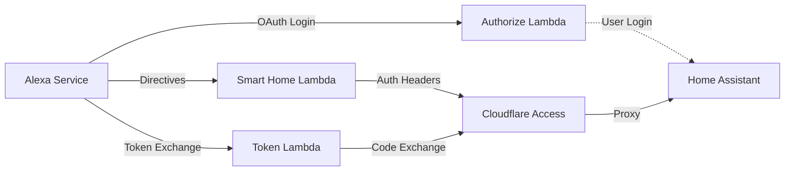
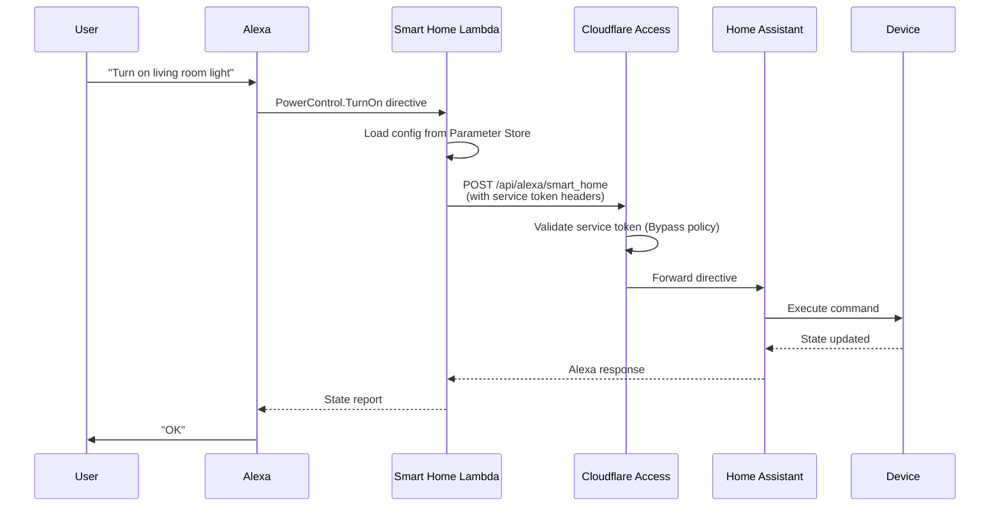

# Home Assistant Alexa Integration

[](https://github.com/tjbaker/ha-alexa/actions)
[](LICENSE)
[](https://www.python.org/downloads/)

**Control your self-hosted Home Assistant with Amazon Alexa—without a subscription.**

## Table of Contents

- [What Is This?](#what-is-this)
- [Why Does This Exist?](#why-does-this-exist)
- [Features](#features)
- [Prerequisites](#prerequisites)
- [Quick Start](#quick-start)
- [Installation](#installation)
  - [Clone Repository](#1-clone-repository)
  - [Setup Virtual Environment](#2-setup-virtual-environment-development)
  - [Deploy to AWS Lambda](#3-deploy-to-aws-lambda)
- [Cloudflare Tunnel Setup](#cloudflare-tunnel-setup)
- [Configure Alexa Skill](#configure-alexa-skill)
- [Home Assistant Configuration](#home-assistant-configuration)
- [Enable Skill and Link Account](#enable-skill-and-link-account)
- [Architecture](#architecture)
- [Development](#development)
- [Troubleshooting](#troubleshooting)
- [Security Considerations](#security-considerations)
- [Contributing](#contributing)
- [Support This Project](#support-this-project)
- [References](#references)
- [License](#license)

## What Is This?

This project enables **native Alexa Smart Home integration** for self-hosted Home Assistant installations. Say "Alexa, turn on the living room lights" and control your HA devices directly through Amazon's official Smart Home API.

## Why Does This Exist?

Self-hosted Home Assistant needs a publicly accessible endpoint with OAuth 2.0, HTTPS, and complex security to talk to Alexa's cloud services. While subscription services exist, this project provides a **free, open-source alternative** where you maintain complete control:

- ✅ **Your infrastructure** - AWS Lambda and Cloudflare Tunnel under your account
- ✅ **Your data** - Commands flow through your own servers, not a third party
- ✅ **Your security** - You decide encryption, access controls, and audit logging
- ✅ **Your privacy** - No vendor can monetize, analyze, or share your usage patterns
- ⚠️ **Your responsibility** - You handle setup, updates, and troubleshooting

**Best for:** Self-hosters who want to learn AWS infrastructure, prefer no subscriptions, or are already running Cloudflare Tunnel.

## Features

- **Smart Home Control** - Forward Alexa directives to Home Assistant (Discovery, PowerControl, BrightnessControl, etc.)
- **Stateless OAuth** - JWT-based authorization flow
- **Zero-Trust Security** - Cloudflare Access authentication for all Home Assistant requests
- **Token Sanitization** - Automatic redaction of sensitive data in logs
- **Encrypted Secrets** - SecureString storage in AWS Parameter Store with KMS encryption

## Prerequisites

### Deployment Requirements

- Python 3.13+ (for running deployment script)
- AWS Account
- Self-hosted Home Assistant with Alexa integration
- Cloudflare Account (free tier)
- Domain or subdomain you control (e.g., `homeassistant.yourdomain.com`)
- AWS SAM CLI

### Development Requirements (Optional)

- Development dependencies (`pip install -e ".[dev]"`) - for linting, testing, type checking

## Quick Start

1. Setup Cloudflare Tunnel for Home Assistant
2. Clone and deploy Lambda functions using AWS SAM
3. Create Alexa skill in Developer Console
4. Configure Home Assistant for Alexa
5. Enable skill in Alexa app and discover devices

## Installation

### 1. Clone Repository

```bash
git clone https://github.com/tjbaker/ha-alexa.git
cd ha-alexa
```

### 2. Setup Virtual Environment (Development)

```bash
python3 -m venv .venv
source .venv/bin/activate
pip install -e ".[dev]"
```

### 3. Deploy to AWS Lambda

**Prerequisites:**
- AWS SAM CLI installed (`brew install aws-sam-cli`)
- AWS credentials configured (`aws configure`)
- Cloudflare Access service token (complete [Cloudflare Tunnel Setup](#cloudflare-tunnel-setup) first)

**Why a Custom Deployment Script?**

This project uses `deploy.py` instead of `sam deploy --guided` for maximum security:

**The Problem:** CloudFormation's `AWS::SSM::Parameter` resource type only supports `Type: String`, not `Type: SecureString`. This means:
- ❌ Secrets stored as plain text in Parameter Store
- ❌ Secrets visible in AWS console
- ❌ Secrets logged in CloudFormation events/change sets

**The Solution:** Our `deploy.py` script:
- ✅ Creates parameters **externally** as `SecureString` with KMS encryption
- ✅ Secrets never visible in AWS console (encrypted at rest)
- ✅ Secrets never logged in CloudFormation
- ✅ CloudFormation only receives **parameter paths**, not values

```bash
# Run the secure deployment script
python3 deploy.py
```

The script will prompt you for:
- **Stack name** (default: `ha-alexa`) - loaded from `samconfig.toml` if exists
- **AWS Region** (default: `us-east-1`)
- **Home Assistant URL** (e.g., `https://homeassistant.yourdomain.com`)
- **Alexa Skill ID** (`amzn1.ask.skill.xxx` - get from Alexa Developer Console)
- **Alexa Vendor ID** (extracted from Alexa redirect URIs, see below)
- **Verify SSL** (default: `true`)
- **Debug Mode** (default: `false`)
- **Cloudflare Client ID** (secret - not echoed)
- **Cloudflare Client Secret** (secret - not echoed)
- **OAuth JWT Secret** (secret - generate with `openssl rand -base64 32`)

**💡 Tip:** On subsequent deployments, the script loads defaults from `samconfig.toml` - just press Enter to accept existing values and only re-enter the 3 secrets.

The script will:
1. **Create SecureString parameters** in Parameter Store with KMS encryption
2. **Build** the Lambda package with `sam build`
3. **Deploy** the CloudFormation stack with `sam deploy`
4. **Display** the function URLs you need for Alexa configuration

**View deployment outputs:**
```bash
sam list stack-outputs --stack-name ha-alexa
```

**To delete everything:**
```bash
python3 deploy.py  # Choose "delete" when prompted
sam delete --stack-name ha-alexa
```

## Cloudflare Tunnel Setup

<details>
<summary>Click to expand Cloudflare setup instructions</summary>

### Install Cloudflare Tunnel

**For Home Assistant OS or Supervised (Recommended):**

1. **Install Add-on**
   - Settings > Add-ons > Add-on Store
   - Search for "Cloudflare Tunnel"
   - Install the official Cloudflare add-on

2. **Configure Add-on**
   - Get Cloudflare Tunnel token from Cloudflare Zero Trust dashboard
   - Add token to add-on configuration
   - Start the add-on

3. **Setup DNS**
   - In Cloudflare dashboard, point your domain to the tunnel
   - Example: `homeassistant.yourdomain.com` → your tunnel

**Note:** Alternative installation methods exist for Home Assistant Container/Core (manual `cloudflared` installation), but are not included here for brevity. See [Cloudflare Tunnel documentation](https://developers.cloudflare.com/cloudflare-one/connections/connect-networks/) for manual setup options.

### Setup Cloudflare Access (Required)

In Cloudflare Zero Trust dashboard:

1. **Create Service Token First**
   - Zero Trust > Access > Service Auth > Service Tokens
   - Click "Create Service Token"
   - Name: `Lambda Functions`
   - Save the **Client ID** and **Client Secret** (you'll need these for SAM deployment)

2. **Create Application**
   - Zero Trust > Access > Applications > Add an application
   - Type: Self-hosted
   - Name: `Home Assistant`
   - Domain: `homeassistant.yourdomain.com`
   - **Path: Leave empty** (protects entire subdomain)
   
3. **Configure Application Policies**
   
   You need TWO policies - one for Lambda service tokens, one for authorized users:
   
   **Policy 1: Lambda Service Token**
   - Name: `Lambda Service Token`
   - Action: **Bypass**
   - Rule type: Service Auth
   - Selector: `Lambda Functions` (the token you created)
   
   **What "Bypass" means**: When Lambda sends valid service token headers (`CF-Access-Client-Id` and `CF-Access-Client-Secret`), Cloudflare validates them and allows access WITHOUT requiring interactive login. This is for machine-to-machine authentication.
   
   **Policy 2: Authorized User Access**
   - Name: `HA Admin Access`
   - Action: **Allow**
   - Rule type: Emails
   - Value: Add all allowed user email addresses (e.g., `you@example.com`, `family@example.com`)
   - Alternative: Use "Email domain" rule for `@yourdomain.com` to allow all users at your domain
   
   **What "Allow" means**: Users must authenticate with Cloudflare Access (login with their email via One-Time PIN, Google, etc.) BEFORE accessing Home Assistant. This adds a security layer before reaching your HA instance.
   
   Save the application with both policies.

   **Security Model:**
   - Your entire Home Assistant instance is protected by Cloudflare Access
   - Lambda functions authenticate automatically using service tokens (bypass policy)
   - You authenticate with your email/Cloudflare Access when accessing HA from a browser (allow policy)
   - Nothing is exposed to the public internet without authentication

</details>

## Configure Alexa Skill

### 1. Create Smart Home Skill

1. Go to [Alexa Developer Console](https://developer.amazon.com/alexa/console/ask)
2. Create Skill > Smart Home > Custom Model
3. Note the **Skill ID** (starts with `amzn1.ask.skill.`)

### 2. Configure Smart Home API

- **Default Endpoint**: Your `AlexaSmartHomeFunctionArn` from SAM deployment
- **Payload version**: v3
- **Account Linking**: Required (configure below)

### 3. Setup Account Linking

In the Alexa Developer Console, go to your skill's **Account Linking** section:

- **Authorization Grant Type**: Auth Code Grant
- **Authorization URI**: Your `AlexaAuthorizeFunctionUrlOutput` 
- **Access Token URI**: Your `AlexaOAuthFunctionUrl`
- **Your Client ID**: Use the same value as Authorization URI
- **Your Secret**: Generate a random string with `openssl rand -base64 32` (Home Assistant ignores this, but Alexa requires it)
- **Scope**: `smart_home`
- **Domain List**: Your Home Assistant domain (e.g., `homeassistant.yourdomain.com`)

After saving, scroll down to view **Redirect URIs** generated by Alexa:
```
https://pitangui.amazon.com/api/skill/link/ABCD1234EFGH
https://alexa.amazon.com/api/skill/link/ABCD1234EFGH
https://layla.amazon.com/api/skill/link/ABCD1234EFGH
```

Copy the text after `/link/` (e.g., `ABCD1234EFGH`) - this is your **AlexaVendorId** for SAM deployment.

### 4. Enable for Testing

- Go to Test > Enable for testing in "Development"
- Save and deploy skill

## Home Assistant Configuration

Add or update the following sections in your `configuration.yaml`:

```yaml
# Core Configuration
homeassistant:
  external_url: https://homeassistant.yourdomain.com

# HTTP Configuration
http:
  use_x_forwarded_for: true
  trusted_proxies:
    - 173.245.48.0/20    # Cloudflare IPs
    - 103.21.244.0/22
    - 103.22.200.0/22
    - 103.31.4.0/22
    - 141.101.64.0/18
    - 108.162.192.0/18
    - 190.93.240.0/20
    - 188.114.96.0/20
    - 197.234.240.0/22
    - 198.41.128.0/17
    - 162.158.0.0/15
    - 104.16.0.0/13
    - 104.24.0.0/14
    - 172.64.0.0/13
    - 131.0.72.0/22
    - 172.30.32.0/23     # Add your Docker/local network CIDR if applicable
  cors_allowed_origins:
    - https://alexa.amazon.com
    - https://layla.amazon.com
    - https://pitangui.amazon.com
    - https://alexa.amazon.co.jp

# Alexa Integration
alexa:
  smart_home:
```

Restart Home Assistant.

## Enable Skill and Link Account

1. Open Alexa app
2. More > Skills & Games > Your Skills > Dev
3. Find your skill and Enable
4. When prompted, log in to Home Assistant
5. After linking completes, Alexa will automatically discover all supported devices

**Supported Device Types:**

This integration forwards all requests to Home Assistant's native Alexa integration, which supports:
- **Lights** (on/off, brightness, color) - ✅ Tested
- Switches
- Fans (on/off, speed)
- Climate/Thermostats (temperature, mode)
- Locks
- Covers (blinds, garage doors)
- Scenes
- Scripts
- Media Players
- Sensors (temperature, contact, motion - for routines)

See [Home Assistant Alexa documentation](https://www.home-assistant.io/integrations/alexa/) for complete device support details.

You can also manually trigger discovery by saying "Alexa, discover devices" or through the Alexa app (Devices > + > Add Device > Other).

### Testing in Alexa Developer Console

Once your skill is enabled and account is linked, you can test it in the Alexa Developer Console:

1. Go to your skill in the Alexa Developer Console
2. Navigate to **Test** tab
3. Enable testing in "Development" mode
4. Use the test simulator to send directives:
   - Type: "discover my devices"
   - Type: "turn on [device name]"
   - Or use the **JSON Input** to send custom directives

This is useful for debugging without needing to speak to an Alexa device.

## Architecture

### Components

Three Lambda functions work together to provide a complete Alexa Smart Home integration:

**1. Smart Home Handler (`alexa_smart_home_handler.py`)**
- Receives Alexa Smart Home directives (e.g., TurnOn, SetBrightness, Discovery)
- Forwards directives to Home Assistant's `/api/alexa/smart_home` endpoint
- Authenticates using Cloudflare service tokens
- Returns properly formatted Alexa responses

**2. Authorize Handler (`alexa_authorize_handler.py`)**
- OAuth authorization endpoint for account linking
- Redirects users to Home Assistant for login
- Receives HA authorization code and wraps it in a short-lived JWT
- Redirects back to Alexa with the JWT as the authorization code

**3. Token Handler (`alexa_oauth_handler.py`)**
- OAuth token endpoint for account linking
- Verifies and unwraps JWT authorization codes
- Exchanges the embedded HA code for access/refresh tokens
- Returns tokens to Alexa for storage

**Security**: All sensitive values (Cloudflare credentials, JWT secrets) are stored as SecureString in AWS Parameter Store with KMS encryption (free tier).

### System Overview



### Smart Home Command Flow



## Development

### Commands

```bash
make help           # Show all commands
make install-dev    # Install dev dependencies
make format         # Format code (black + ruff)
make lint           # Run linters
make type-check     # Run mypy
make test           # Run tests
make test-cov       # Run tests with coverage
make clean          # Remove build artifacts
```

### Code Quality

- **Type Checking**: mypy with strict mode, 100% type coverage
- **Linting**: Ruff (50+ rule sets) + Black
- **Testing**: pytest with pytest-cov, pytest-mock
- **Coverage**: Comprehensive test suite with >90% coverage

## Troubleshooting

### Skill Cannot Be Enabled

- Verify Lambda function ARN in Alexa skill configuration
- Check CloudWatch logs for Lambda errors
- Ensure Skill ID is configured in SAM template

### Account Linking Fails

- Verify Function URLs are correct in Alexa skill
- Check Home Assistant is accessible via Cloudflare Tunnel
- Verify OAuth JWT secret matches in both Lambdas
- Check CloudWatch logs for both authorize and token handlers

### "Alexa can't find any devices"

- Verify Home Assistant Alexa integration is configured
- Check `external_url` in HA configuration
- Review Lambda logs for errors during discovery
- Ensure Cloudflare service token policy is configured (Bypass action)

### View Logs

All Lambda function logs are stored in AWS CloudWatch Logs:

```bash
# View all functions
sam logs --stack-name ha-alexa --tail

# Specific function
sam logs --stack-name ha-alexa --name alexa-smart-home --tail
sam logs --stack-name ha-alexa --name alexa-authorize --tail
sam logs --stack-name ha-alexa --name alexa-oauth --tail
```

**Debug Mode**: Enable detailed logging across Lambda functions and Home Assistant to troubleshoot the complete request flow.

#### Lambda Debug Logging

Enable debug logging in Lambda functions to see:
- Complete Alexa directives (device IDs, commands, parameters)
- Full HTTP requests/responses to Home Assistant
- OAuth flow step-by-step
- All sensitive tokens are still automatically sanitized

**Option 1: Via deployment script (recommended)**
```bash
python3 deploy.py
# When prompted for "Enable debug mode", enter: true
```

**Option 2: Directly in Lambda console**
- Go to AWS Lambda console
- Select function (e.g., `alexa-smart-home`)
- Configuration > Environment variables
- Add variable: `DEBUG` = `1`
- Save and repeat for other functions as needed

#### Home Assistant Debug Logging

Enable debug logging in Home Assistant to see:
- Incoming Alexa directives (device commands, discovery requests)
- Entity state mapping and capability reporting
- OAuth token validation and exchange
- Device discovery filtering and entity selection

Add to your `configuration.yaml`:

```yaml
logger:
  default: warning
  logs:
    homeassistant.components.alexa: debug
    homeassistant.components.auth: debug  # Optional: for OAuth/token debugging
```

Then reload the logger (no restart needed):
```bash
Developer Tools > YAML > Reload Logger
# Or via CLI: ha core logs -f
```

### Example 1: Skill Linking Flow (One-Time Setup)

When you enable the Alexa skill and link your account, here's the complete flow:

**Step 1: Initial Authorization (alexa-authorize)** - ~6 seconds
```
[DEBUG] Authorize request: client_id=https://...lambda-url.us-east-1.on.aws, 
        redirect_uri=https://pitangui.amazon.com/api/skill/link/MQTX68E7NM4GF, 
        scope=smart_home, response_type=code
[DEBUG] Redirecting to HA authorize endpoint: base=https://homeassistant.yourdomain.com
[INFO]  Redirecting user to Home Assistant authorize endpoint
```

**Step 2: User Authorizes with Home Assistant**
- User enters Home Assistant credentials
- Home Assistant validates and redirects back to Lambda with authorization code

**Step 3: Authorization Callback (alexa-authorize)** - ~5ms
```
[DEBUG] Authorize request: code=[REDACTED], state=...
[DEBUG] Authorization completed; redirecting back to Alexa: redirect_uri=https://pitangui.amazon.com/...
[INFO]  Authorization completed; redirecting back to Alexa
```

**Step 4: Token Exchange (alexa-oauth)** - ~5 seconds
```
[DEBUG] Token request context: domain=...lambda-url.us-east-1.on.aws, method=POST
[DEBUG] JWT unwrap successful
[DEBUG] Added Cloudflare Access authentication
[INFO]  Forwarding token request to https://homeassistant.yourdomain.com/auth/token
[INFO]  Token exchange successful
[DEBUG] Response: {'access_token': '[REDACTED]', 'token_type': '[REDACTED]', 
         'refresh_token': '[REDACTED]', 'expires_in': 1800, 'ha_auth_provider': 'homeassistant'}
```

**Total account linking time: ~11 seconds**

---

### Example 2: Voice Command Flow (Daily Usage)

When you say **"Alexa, turn off office desk light"**:

**Lambda (alexa-smart-home)** - ~310ms
```
[DEBUG] Processing event: {
  'directive': {
    'header': {
      'messageId': 'badadc0d-6f05-4824-9052-8a18c0f3bdab',
      'namespace': 'Alexa.PowerController',
      'name': 'TurnOff'
    },
    'endpoint': {
      'endpointId': 'light#office_desk_light'
    }
  }
}
[DEBUG] Added Cloudflare Access authentication
[INFO]  Forwarding request to https://homeassistant.yourdomain.com/api/alexa/smart_home
```

**Home Assistant** - ~300ms
```
[DEBUG] Received Alexa Smart Home request: {
  'directive': {
    'header': {'namespace': 'Alexa.PowerController', 'name': 'TurnOff'},
    'endpoint': {'endpointId': 'light#office_desk_light'}
  }
}
[DEBUG] Sending Alexa Smart Home response: {
  'event': {'header': {'namespace': 'Alexa', 'name': 'Response'}},
  'context': {
    'properties': [
      {'name': 'powerState', 'value': 'ON'},
      {'name': 'brightness', 'value': 100},
      {'name': 'connectivity', 'value': {'value': 'OK'}}
    ]
  }
}
```

**Lambda Response** - ~60ms
```
[INFO]  Request completed successfully
[DEBUG] Response: {
  'event': {
    'header': {'namespace': 'Alexa', 'name': 'Response'},
    'endpoint': {'endpointId': 'light#office_desk_light'}
  },
  'context': {
    'properties': [
      {'name': 'powerState', 'value': 'ON'},
      {'name': 'brightness', 'value': 100},
      {'name': 'colorTemperatureInKelvin', 'value': 5263},
      {'name': 'connectivity', 'value': {'value': 'OK'}}
    ]
  }
}
```

**Total command latency: ~370ms** (0.37 seconds)

**Note:** Home Assistant access tokens expire after **30 minutes** (1800 seconds). When the token expires, Alexa automatically refreshes it via the `alexa-oauth` Lambda before sending the next command (adds ~5 seconds to the first command only).

## Security Considerations

### Infrastructure Security

- **Zero-Trust Architecture**: Entire Home Assistant subdomain protected by Cloudflare Access
- **No Public Exposure**: Nothing accessible from internet without authentication
- **Encrypted Secrets**: All credentials stored as SecureString in AWS Parameter Store with KMS encryption (never logged in CloudFormation)
- **Service Token Authentication**: Lambda functions use Cloudflare service tokens for automated access

### IAM Hardening

- **Least Privilege Access**: Lambda functions can only read the three specific parameters they need (Cloudflare credentials, JWT secret)
- **Read-Only Policy**: Explicit deny prevents Lambda functions from modifying or deleting any parameters
- **KMS Restrictions**: Decryption only allowed via SSM service (prevents arbitrary KMS decrypt operations)
- **Event Source Validation**: Smart Home function validates Alexa Skill ID before processing directives
- **Resource Isolation**: Parameters are namespaced per stack (e.g., `/ha-alexa/cloudflare-client-id`)

### Application Security

- **JWT Security**: Authorization codes expire in 5 minutes with HMAC-SHA256 signing
- **Token Sanitization**: All sensitive data automatically redacted in logs
- **SSL Enforcement**: Certificate verification enabled by default
- **Redirect Validation**: OAuth redirect URIs strictly validated against Alexa domains
- **Stateless Design**: No persistent storage or database required

## Contributing

Contributions welcome! Please ensure:

1. All tests pass (`make test`)
2. Code is formatted (`make format`)
3. No linting errors (`make lint`)
4. Type checking passes (`make type-check`)
5. Coverage remains above 90%

## Support This Project

If you find this integration useful and want to say thanks, you can send me some USDC to grab a cup of coffee! ☕ Your support helps keep this project maintained and updated with new features.

**💙 USDC on Base Network**

<p align="center">
  
</p>

**Address**: `0x7CC11505c5fBb8FB0c52d2f63fd9A44763246397`  
**Network**: Base (not Ethereum mainnet)

*Completely optional! This project is and will always be free and open source.* ❤️

## References

- **[Home Assistant Alexa Integration](https://www.home-assistant.io/integrations/alexa/)** - Official HA Alexa documentation
- **[Alexa Smart Home API](https://developer.amazon.com/en-US/docs/alexa/smarthome/understand-the-smart-home-skill-api.html)** - Amazon's Smart Home Skill API documentation
- **[Cloudflare Tunnel](https://developers.cloudflare.com/cloudflare-one/connections/connect-networks/)** - Cloudflare Zero Trust Tunnel documentation
- **[AWS SAM CLI](https://docs.aws.amazon.com/serverless-application-model/latest/developerguide/what-is-sam.html)** - AWS Serverless Application Model documentation
- **[AWS Lambda](https://docs.aws.amazon.com/lambda/)** - AWS Lambda documentation
- **[AWS Parameter Store](https://docs.aws.amazon.com/systems-manager/latest/userguide/systems-manager-parameter-store.html)** - AWS Systems Manager Parameter Store documentation

## License

Copyright 2025 Trevor Baker. All rights reserved.

Licensed under the Apache License, Version 2.0 (the "License");
you may not use this file except in compliance with the License.
You may obtain a copy of the License at

    http://www.apache.org/licenses/LICENSE-2.0

Unless required by applicable law or agreed to in writing, software
distributed under the License is distributed on an "AS IS" BASIS,
WITHOUT WARRANTIES OR CONDITIONS OF ANY KIND, either express or implied.
See the License for the specific language governing permissions and
limitations under the License.
